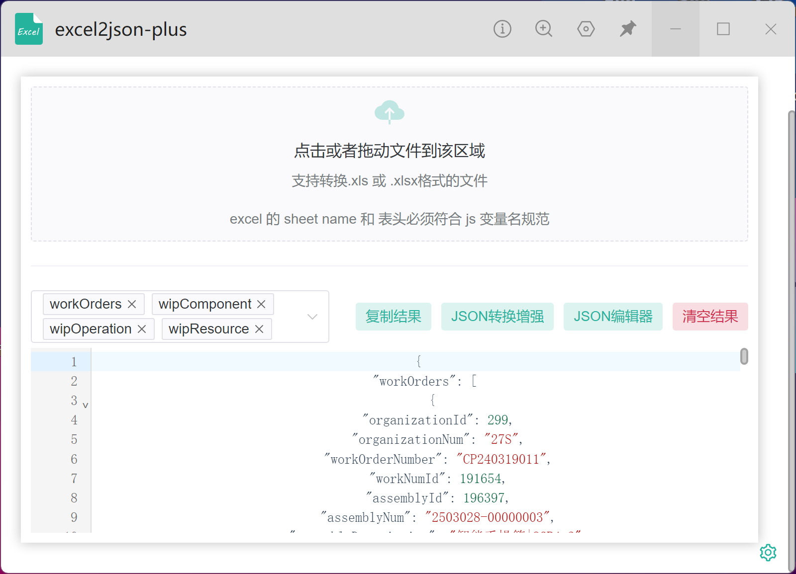
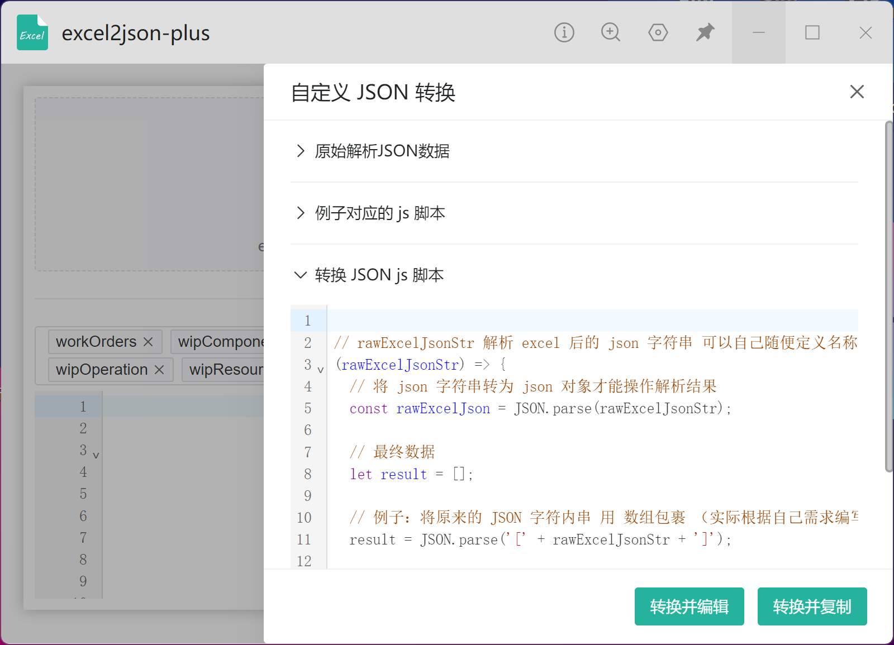
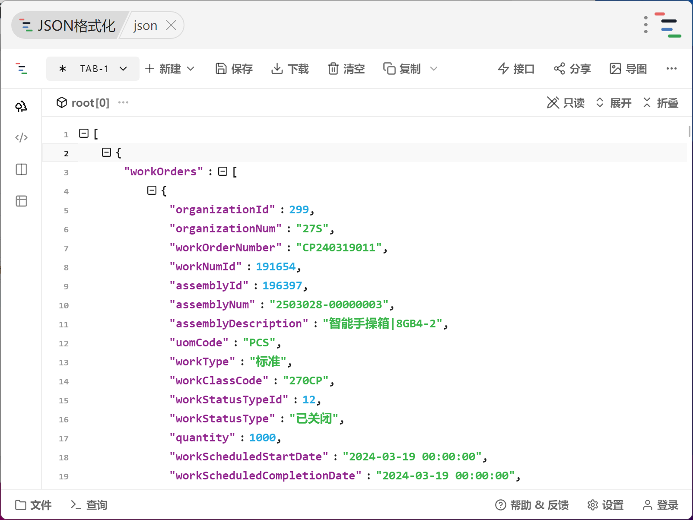
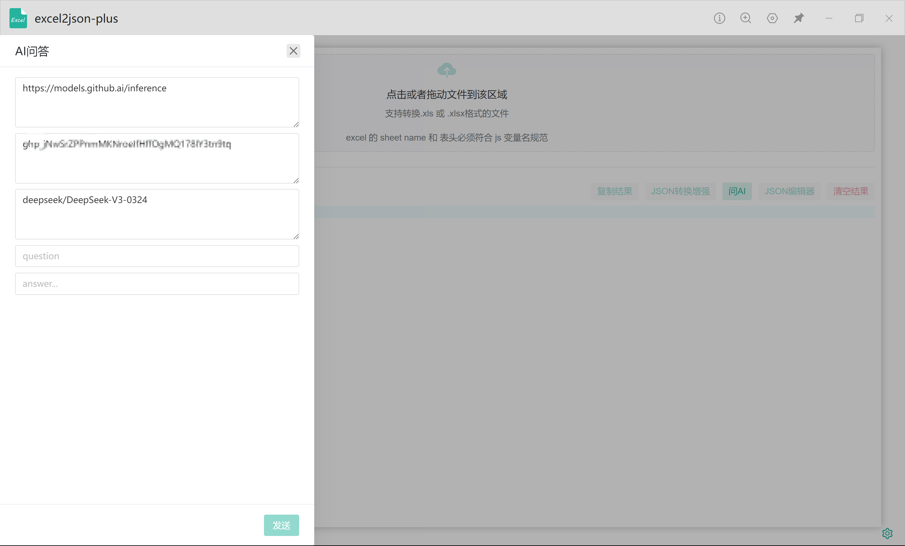
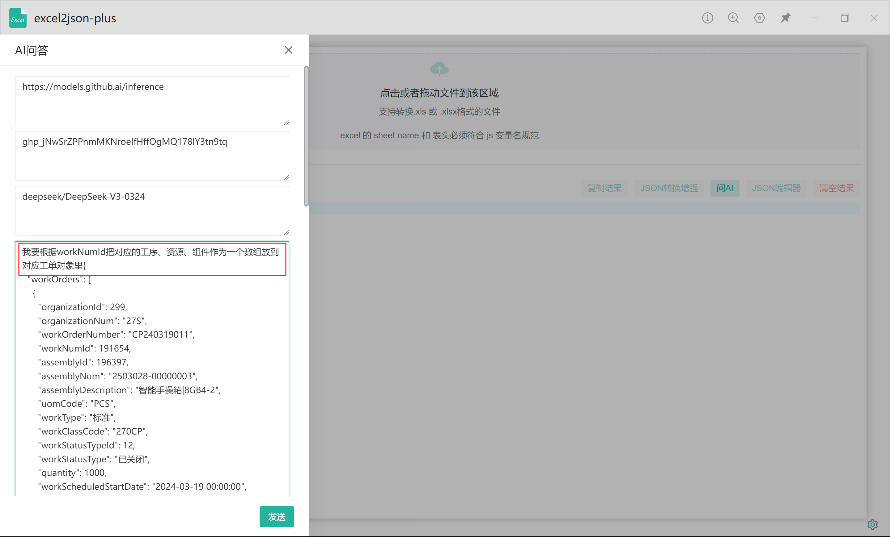
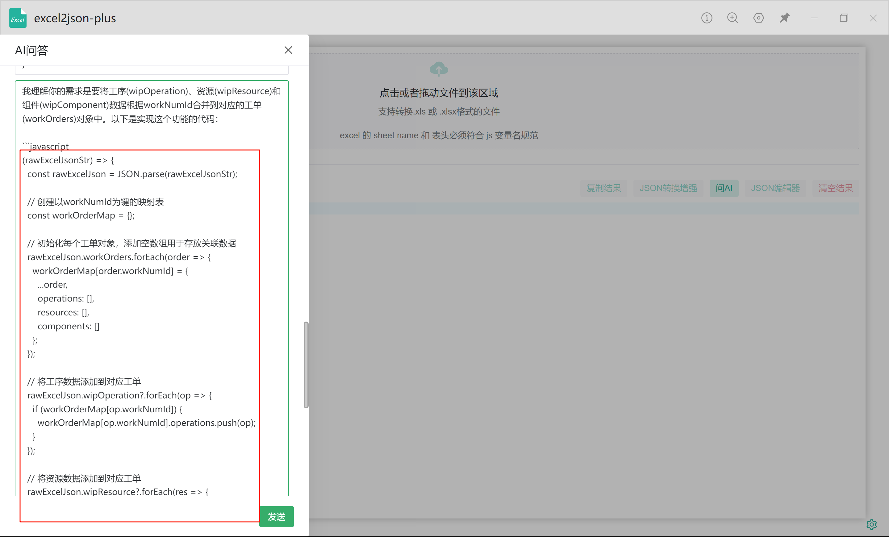
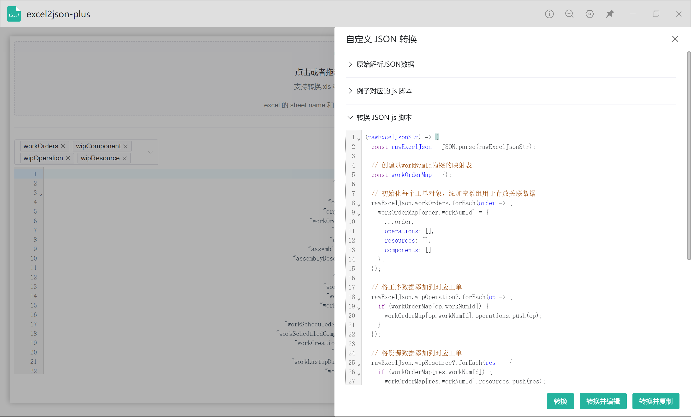
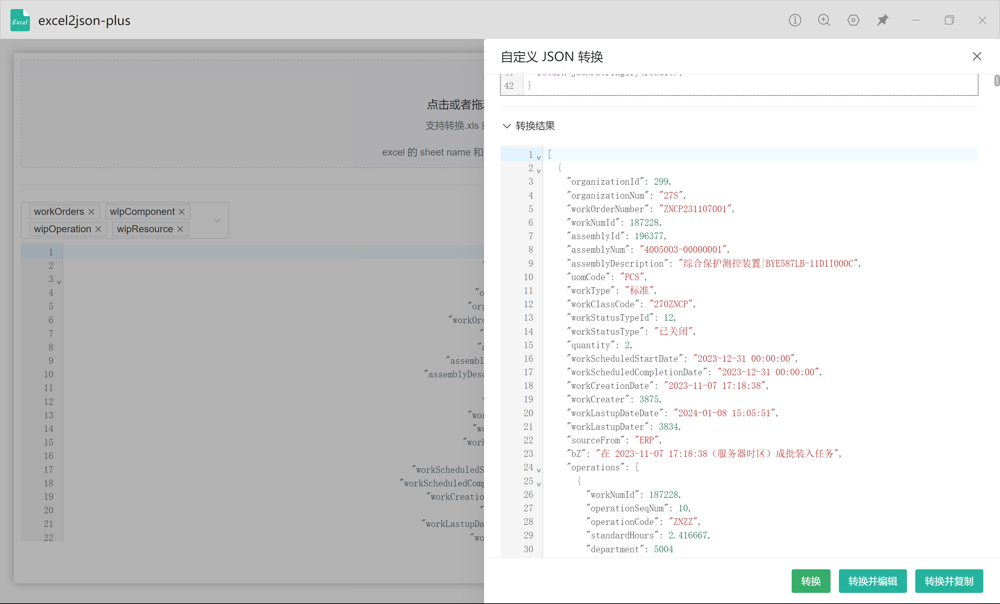

# utools-excel2json-plus

> 选择 excel 文件，转换输出 JSON 格式；可选择格式化 JSON 数据，一键复制；JSON转换增强，可支持自定义转换 js 脚本。

在 `doc\example.xlsx`下有例子数据，导入后等待一段时间（因数据大小而定），导入完成后点击按钮`JSON转换增强`,再直接点击`转换并编辑`按钮或者 `转换并复制`按钮

注意：
 
1. excel 文件 sheet name、表头列字段最好是 js 的变量定义规则！！！
2. js 脚本使用不是自己编写的要注意安全性！！！

## 技术栈

vue3 + vite2 + utools

## 功能规划

-[ ] 导入Excel及解析有进度提示
-[x] js在线脚本转换JSON增强
-[x] 转换结果展示在界面

## 在线预览
在线预览JSON转换增强的，编辑及复制都不能用（JSON编辑需要跳转到utools的第三方JSON编辑器，复制到剪切板用的utools的方法）
 
[https://utools-excel2json-plus.vercel.app/](https://utools-excel2json-plus.vercel.app/)
 

## utools插件安装
1. 由于在 utools 发布审核失败，提供 utools 插件离线安装包，安装包在 `utools-offline-setup/excel2json-plus-1.0.0.upxs`
2. 等待 utools 审核发布成功后在插件市场搜索 `excel2json-plus` 进行安装

## 版本记录

### v2.0.0
- Github Models集成，可AI帮编写转换js函数
- 基础lib升级到最新版

### v2.0.0

- 大数据界面卡顿修复
- UI 美化

### v1.0.0

- js 脚本增强

